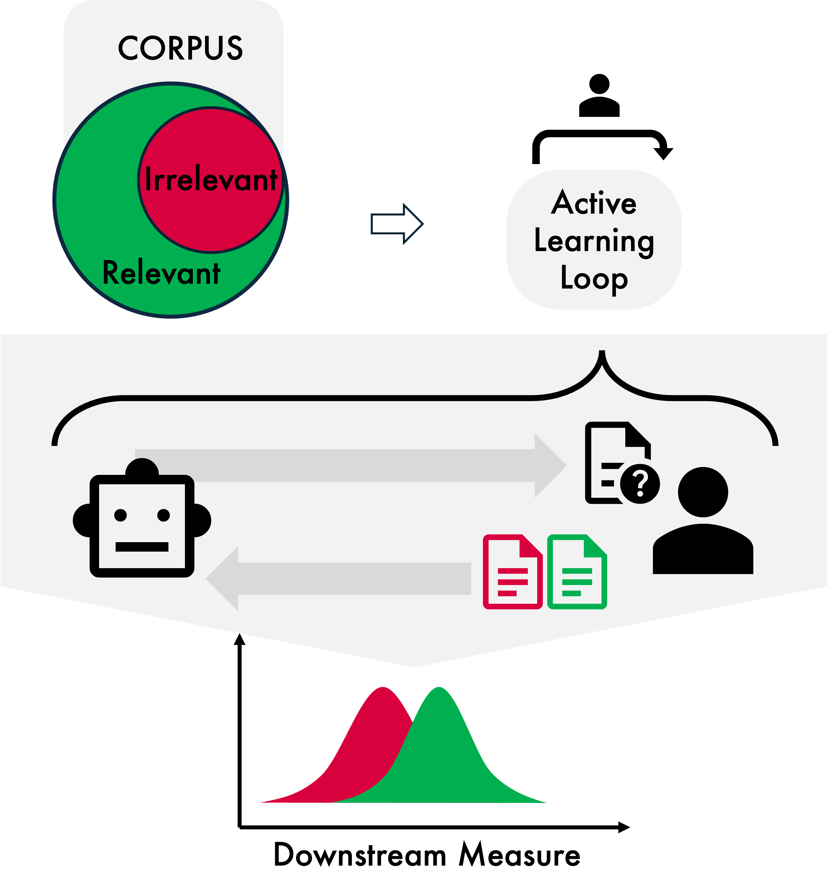

<div align="center">

# Active Learning for Corpus Refinement
## _Cost-Effective Preprocessing to Improve Validity of Applied Quantitative Text Analysis_


[](https://aclanthology.org/2026.eacl-srw.70/) \
Jakob Steglich, Stephan Poppe \
**Contact:** jakob.steglich@uni-leipzig.de, stephan.poppe@uni-leipzig.de

<p align="center">
    | 🔍&nbsp;<a href="#-about">Overview</a>
    | 📂&nbsp;<a href="#-repository-structure">Repository Structure</a>
    | 💿&nbsp;<a href="#-data">Data</a>
    | 🔗&nbsp;<a href="#-citation">Citation</a>
</p>

</div>


## 🔍 Overview

Quantitative text analysis depends on high-quality corpora, yet keyword-based data collection often introduces irrelevant documents that weaken validity. This project demonstrates how active learning combined with a transformer-based classifier can iteratively refine text corpora by filtering out irrelevant content.
Using German newspaper articles on depression and schizophrenia as a case study, the approach achieves strong performance (F1 ≈ 0.8) with as few as 100–150 labeled snippets, significantly reducing annotation effort. Compared to random and weakly supervised sampling, active learning improves both efficiency and construct validity while encouraging clearer inclusion criteria and handling of edge cases.
Results show that filtering non-medical articles has minimal impact on depression-related measures but increases observed stigmatization in schizophrenia coverage. Overall, this method enables scalable, accurate corpus validation with minimal preprocessing.

<div align="center">

</div>


## 📂 Repository Structure

```text
.
├── active_learning_related/
│   ├── 00_dataset_generation.ipynb
│   ├── activelearning_depression.ipynb
│   ├── activelearning_schizophrenia.ipynb
│   ├── bestmodel_finalpred_depression.ipynb
│   ├── bestmodel_finalpred_schizophrenia.ipynb
│   ├── cosinebootstrap_depression.ipynb
│   ├── cosinebootstrap_schizophrenia.ipynb
│   ├── randomsampling_depression.ipynb
│   ├── randomsampling_schizophrenia.ipynb
│   ├── learning_trajectories_plots.Rmd
│   ├── sbert_encodings.py
│   ├── param_opt_depression.py
│   ├── param_opt_schizophrenia.py
│   └── modules/
│       └── smalltext_pipeline.py
├── preprocessing/
│   ├── preprocessing.R
│   └── preprocessing_functions.R
├── stigma_analysis/
│   ├── comparative_analysis.Rmd
│   └── stigmascore_computation/
│       ├── compute_stigmascores.Rmd
│       ├── stigmascore_functions.R
│       └── tokenisation.R
├── figures/
├── README.md
└── LICENSE
```

## 💿 Data
All data are available upon request from the authors.


## 🔗 Citation

If you're using this repository, please cite using the following BibTeX:

```bibtex
@inproceedings{steglich2026active,
  title={Active Learning for Corpus Refinement: Cost-Effective Preprocessing to Improve Validity of Applied Quantitative Text Analysis},
  author={Steglich, Jakob and Poppe, Stephan},
  booktitle={Proceedings of the 19th Conference of the European Chapter of the Association for Computational Linguistics (Volume 4: Student Research Workshop)},
  pages={952--966},
  year={2026}
}
```
---